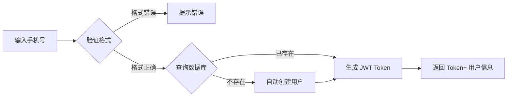

# 产品需求文档 (PRD)

**文档状态:** ✅ 已定稿  
**版本号:** v2.0  
**创建日期:** 2026-03-12  
**最后更新:** 2026-03-12 16:52  
**负责人:** 灌汤 (PM)

---

## 📋 文档信息

| 项目 | 内容 |
|------|------|
| **产品名称** | 包子铺博客系统 |
| **需求名称** | 博客系统核心功能 |
| **需求类型** | 新功能 |
| **优先级** | P0-紧急 |
| **预计工期** | 11 个工作日 |
| **预计上线** | 2026-03-26 |

---

## 📝 修订历史

| 版本 | 日期 | 修改人 | 修改内容 | 审批人 |
|------|------|--------|----------|--------|
| v2.0 | 2026-03-12 16:52 | 灌汤 | 使用标准 PRD 模板重新整理 | 待审批 |
| v1.0 | 2026-03-10 | 灌汤 | 初始版本 | - |

---

## 1. 背景与目标

### 1.1 业务背景

**现状:**
- Agent 团队协作开发，需要透明化的工作进度展示
- 工作日志手动记录效率低，容易遗漏
- 缺少统一的知识库和文档管理平台

**痛点:**
- 工作进度不透明，PM 难以掌握各 Agent 状态
- 日志记录不规范，难以追溯和复盘
- 文档分散，难以查找和维护

**机会点:**
- 使用 OpenClaw 框架实现多 Agent 协作
- 自动化工作日志提交，减少人工操作
- 统一文档管理，提升团队效率

### 1.2 产品目标

**SMART 目标:**
- **Specific:** 构建轻量级博客系统，支持 Agent 工作日志自动提交
- **Measurable:** 日志自动提交率 100%，文档完整率≥95%
- **Achievable:** 基于 OpenClaw 框架，4 个 Agent 协作开发
- **Relevant:** 提升团队透明度，降低沟通成本
- **Time-bound:** 11 个工作日内完成开发并上线

### 1.3 成功指标

| 指标名称 | 当前值 | 目标值 | 测量方式 |
|----------|--------|--------|----------|
| 日志自动提交率 | 0% | 100% | 系统统计 |
| 文档完整率 | 28% | ≥95% | 文档检查 |
| 心跳同步及时率 | - | ≥95% | 心跳看板 |
| 任务按时完成率 | - | ≥90% | 项目计划跟踪 |

---

## 2. 需求范围

### 2.1 需求列表

| 优先级 | 需求 ID | 需求名称 | 需求描述 | 验收标准 |
|--------|---------|----------|----------|----------|
| P0 | REQ-001 | 手机号登录 | 用户通过手机号登录，自动注册 | 11 位手机号可登录，无需验证码 |
| P0 | REQ-002 | 文章管理 | 支持 Markdown 格式文章 CRUD | 支持代码高亮、表格、流程图 |
| P0 | REQ-003 | 分类标签 | 文章支持分类和多标签 | 可创建/编辑/删除分类标签 |
| P0 | REQ-004 | 权限控制 | 文章分级访问（公开/登录/VIP） | 不同级别正确拦截 |
| P0 | REQ-005 | 日志自动化 | 每日 18:00 自动提交工作日志 | 自动发布为博客文章 |
| P1 | REQ-006 | 心跳机制 | 每 10 分钟同步 Agent 状态 | 心跳看板实时更新 |
| P1 | REQ-007 | 文档优先 | 任务分配附带文档链接 | 100% 任务有文档链接 |

### 2.2 不在范围 (Out of Scope)

- ❌ 评论系统（阶段 2）
- ❌ 付费 VIP 功能（阶段 2）
- ❌ 多语言支持（阶段 3）
- ❌ 移动端 APP（阶段 3）

---

## 3. 用户故事

### 3.1 用户角色

| 角色 | 描述 | 核心诉求 |
|------|------|----------|
| 访客 | 未登录用户 | 浏览公开文章 |
| 读者 | 已登录用户 | 浏览所有文章、收藏、评论 |
| 作者 | 内容创作者 | 创建/编辑/删除文章 |
| 管理员 | 系统管理者 | 用户管理、内容审核、系统配置 |
| Agent | 自动化 Agent | 自动提交工作日志、同步状态 |

### 3.2 用户故事地图

**访客:**
```
作为 访客
我希望 浏览公开文章
以便 了解博客内容
```

**作者:**
```
作为 作者
我希望 使用 Markdown 编辑器写文章
以便 快速发布高质量内容
```

**Agent:**
```
作为 Agent
我希望 每 10 分钟自动同步心跳
以便 PM 掌握我的工作状态
```

```
作为 Agent
我希望 每日 18:00 自动提交工作日志
以便 减少人工操作，保证日志完整
```

---

## 4. 功能详情

### 4.1 功能清单

| 功能模块 | 功能点 | 优先级 | 复杂度 | 备注 |
|----------|--------|--------|--------|------|
| 用户认证 | 手机号登录 | P0 | 低 | 自动注册 |
| 用户认证 | JWT Token 管理 | P0 | 中 | 有效期 2 小时 |
| 文章管理 | 文章 CRUD | P0 | 中 | Markdown 渲染 |
| 文章管理 | 分类管理 | P0 | 低 | 树形结构 |
| 文章管理 | 标签管理 | P0 | 低 | 多对多关系 |
| 权限控制 | 文章分级访问 | P0 | 中 | 公开/登录/VIP |
| 日志自动化 | 定时任务 | P0 | 高 | 每日 18:00 |
| 日志自动化 | 工作日志转文章 | P0 | 中 | 自动发布 |
| 心跳机制 | 心跳同步 | P1 | 中 | 每 10 分钟 |
| 心跳机制 | 心跳看板 | P1 | 低 | 实时更新 |

### 4.2 功能详细说明

#### 功能 1: 手机号登录

**功能描述:**
用户通过 11 位手机号登录，系统自动判断是否注册。已存在则生成 JWT Token，不存在则自动创建用户后生成 Token。

**业务流程:**


**数据规则:**
| 字段 | 类型 | 长度 | 必填 | 默认值 | 校验规则 |
|------|------|------|------|--------|----------|
| phone | string | 11 | 是 | - | `^1[3-9]\d{9}$` |
| password_hash | string | 255 | 是 | - | bcrypt 加密 |
| nickname | string | 50 | 否 | 用户 ID | - |
| created_at | datetime | - | 是 | NOW() | - |

**异常处理:**
| 异常场景 | 处理方式 | 提示文案 |
|----------|----------|----------|
| 手机号格式错误 | 前端验证 | "请输入正确的 11 位手机号" |
| 网络错误 | 重试机制 | "网络开小差了，请重试" |
| 服务器错误 | 降级处理 | "服务器繁忙，请稍后再试" |

---

#### 功能 2: 文章管理

**功能描述:**
支持 Markdown 格式文章的创建、读取、更新、删除，后端渲染为 HTML 供前端展示。

**业务流程:**


**数据规则:**
| 字段 | 类型 | 长度 | 必填 | 默认值 | 校验规则 |
|------|------|------|------|--------|----------|
| title | string | 200 | 是 | - | 不能为空 |
| content | text | - | 是 | - | Markdown 格式 |
| html_content | text | - | 是 | - | HTML 格式 |
| status | string | 20 | 是 | draft | draft/published/archived |
| access_level | string | 20 | 是 | public | public/login/vip |

**异常处理:**
| 异常场景 | 处理方式 | 提示文案 |
|----------|----------|----------|
| Markdown 渲染失败 | 降级显示原文 | "渲染失败，显示原文" |
| 文章不存在 | 返回 404 | "文章不存在或已删除" |
| 无权限访问 | 返回 403 | "无权访问此文章" |

---

## 5. 非功能需求

### 5.1 性能要求

| 指标 | 要求 | 测量方式 |
|------|------|----------|
| 页面加载时间 | < 2 秒 | Chrome DevTools |
| API 响应时间 | P95 < 200ms | 监控平台 |
| 心跳同步延迟 | < 10 秒 | 心跳看板 |
| 日志提交延迟 | < 1 分钟 | 系统日志 |

### 5.2 安全要求

- [x] 用户输入验证（手机号格式、XSS 防护）
- [x] SQL 注入防护（参数化查询）
- [x] XSS 防护（输入过滤、输出转义）
- [x] CSRF 防护（Token 验证）
- [x] 敏感数据加密（密码 bcrypt 加密）
- [x] JWT Token 认证（有效期 2 小时）

### 5.3 兼容性要求

| 平台 | 版本要求 |
|------|----------|
| 浏览器 | Chrome 80+, Safari 13+, Firefox 75+ |
| 移动端 | iOS 13+, Android 8+ |
| Node.js | v20+ |
| Java | JDK 21+ |

---

## 6. 数据埋点

| 事件名称 | 触发时机 | 事件参数 | 用途 |
|----------|----------|----------|------|
| user_login | 用户登录成功 | user_id, login_type | 统计登录情况 |
| article_view | 文章被浏览 | article_id, user_id, access_level | 统计阅读量 |
| article_create | 文章创建 | article_id, user_id, word_count | 统计创作情况 |
| heartbeat_sync | 心跳同步 | agent_id, task_id, progress | 监控 Agent 状态 |
| worklog_submit | 工作日志提交 | agent_id, log_id, word_count | 统计日志提交 |

---

## 7. 风险与依赖

### 7.1 技术风险

| 风险 | 概率 | 影响 | 等级 | 应对措施 | 负责人 |
|------|------|------|------|----------|--------|
| Markdown 渲染性能 | 中 | 中 | 🟡 | 缓存渲染结果 | 酱肉 |
| JWT Token 安全 | 低 | 高 | 🟡 | 使用 HTTPS，定期更换密钥 | 酱肉 |
| 定时任务失败 | 中 | 高 | 🟡 | 失败重试，告警通知 | 酸菜 |
| 数据库性能瓶颈 | 低 | 中 | 🟡 | 添加索引，读写分离 | 酱肉 |

### 7.2 依赖项

| 依赖方 | 依赖内容 | 预计完成时间 | 状态 |
|--------|----------|--------------|------|
| OpenClaw 框架 | Agent 通信机制 | 已完成 | ✅ |
| 阿里云 ECS | 服务器环境 | 已完成 | ✅ |
| MySQL 8.0 | 数据库环境 | 已完成 | ✅ |
| Docker | 容器化部署 | 已完成 | ✅ |

---

## 8. 附录

### 8.1 术语表

| 术语 | 定义 |
|------|------|
| Agent | OpenClaw 框架中的自动化 Agent（灌汤/酱肉/豆沙/酸菜） |
| 心跳 | Agent 每 10 分钟向 PM 同步状态的机制 |
| 工作日志 | Agent 记录工作内容的 Markdown 文档 |
| PRD | 产品需求文档 (Product Requirement Document) |

### 8.2 参考资料

- [OpenClaw 文档](https://docs.openclaw.ai)
- [博客系统开发计划](../guides/博客系统 - 开发计划.md)
- [API 技术方案](../tech/博客系统 - 技术方案.md)
- [原型交互稿](../design/博客系统 - 原型交互稿.md)

---

## ✅ 审批签字

| 角色 | 姓名 | 日期 | 意见 |
|------|------|------|------|
| 产品负责人 | 灌汤 | 2026-03-12 | ✅ 同意 |
| 技术负责人 | 酱肉 | - | ⏳ 待审批 |
| 前端负责人 | 豆沙 | - | ⏳ 待审批 |
| 运维负责人 | 酸菜 | - | ⏳ 待审批 |

---

**文档位置:** `F:\openclaw\agent\doc\prd\博客系统-PRD.md`  
**文档链接:** `doc/prd/博客系统-PRD.md`  
**创建时间:** 2026-03-12 16:52  
**创建耗时:** 25 分钟
