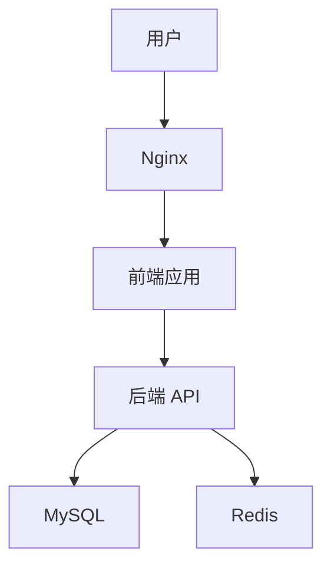
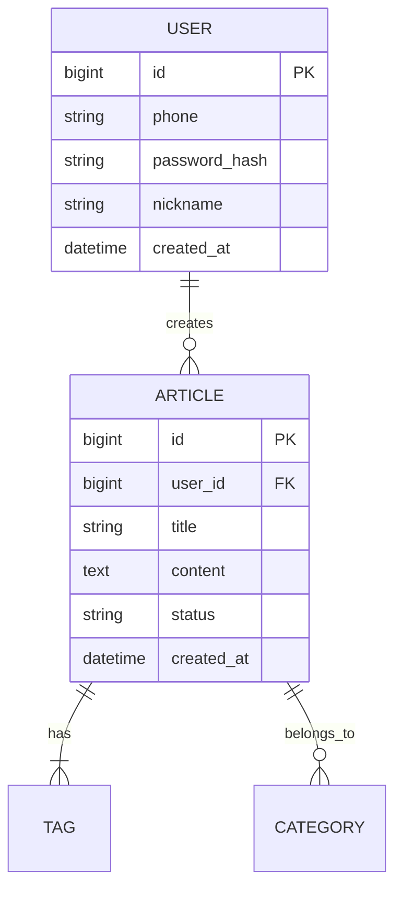

# API 技术方案文档

**文档状态:** 草稿 / 评审中 / 已定稿  
**版本号:** v1.0  
**创建日期:** 2026-03-12  
**最后更新:** 2026-03-12  
**负责人:** 酱肉 (后端)

---

## 📋 文档信息

| 项目 | 内容 |
|------|------|
| **项目名称** | {项目名称} |
| **技术方案名称** | {技术方案名称} |
| **关联 PRD** | [PRD 文档链接] |
| **技术负责人** | 酱肉 |
| **参与评审** | 前端/测试/运维 |
| **预计工期** | {X} 个工作日 |

---

## 📝 修订历史

| 版本 | 日期 | 修改人 | 修改内容 | 审批人 |
|------|------|--------|----------|--------|
| v1.0 | 2026-03-12 | 酱肉 | 初始版本 | - |

---

## 1. 概述

### 1.1 背景
{简述业务背景，关联 PRD}

### 1.2 目标
- 技术方案目标
- 性能目标
- 质量目标

### 1.3 范围
**包含:**
- {包含的内容}

**不包含:**
- {不包含的内容}

---

## 2. 技术选型

### 2.1 技术栈
| 层级 | 技术选型 | 版本 | 理由 |
|------|----------|------|------|
| 后端 | Spring Boot | 3.2+ | 团队熟悉，生态完善 |
| 前端 | Vue 3 | 3.4+ | 响应式，TypeScript 支持 |
| 数据库 | MySQL | 8.0+ | 成熟稳定，支持事务 |
| 缓存 | Redis | 7.0+ | 高性能，数据结构丰富 |

### 2.2 架构模式
- **后端:** RESTful API + MVC
- **前端:** Composition API + Pinia
- **部署:** Docker 容器化

---

## 3. 系统设计

### 3.1 系统架构图


### 3.2 模块划分
| 模块 | 职责 | 负责人 |
|------|------|--------|
| 用户模块 | 登录、注册、权限 | 酱肉 |
| 文章模块 | CRUD、分类、标签 | 酱肉 |
| 前端模块 | 页面、组件、交互 | 豆沙 |

### 3.3 关键流程
```mermaid
sequenceDiagram
    participant 用户
    participant 前端
    participant 后端
    participant 数据库
    
    用户->>前端：发起请求
    前端->>后端：API 调用
    后端->>数据库：查询数据
    数据库-->>后端：返回结果
    后端-->>前端：响应数据
    前端-->>用户：展示结果
```

---

## 4. API 设计

### 4.1 API 清单
| 接口名称 | 方法 | 路径 | 权限 | 负责人 |
|----------|------|------|------|--------|
| 用户登录 | POST | /api/auth/login | 公开 | 酱肉 |
| 文章列表 | GET | /api/articles | 公开 | 酱肉 |
| 文章详情 | GET | /api/articles/{id} | 公开 | 酱肉 |
| 创建文章 | POST | /api/articles | 登录 | 酱肉 |
| 更新文章 | PUT | /api/articles/{id} | 作者 | 酱肉 |
| 删除文章 | DELETE | /api/articles/{id} | 作者/管理员 | 酱肉 |

### 4.2 接口详情

#### 接口 1: 用户登录

**请求:**
```http
POST /api/auth/login
Content-Type: application/json

{
  "phone": "13800138000",
  "password": "password123"
}
```

**响应:**
```json
{
  "code": 200,
  "message": "success",
  "data": {
    "token": "eyJhbGciOiJIUzI1NiIsInR5cCI6IkpXVCJ9...",
    "user": {
      "id": 1,
      "phone": "13800138000",
      "nickname": "用户昵称",
      "avatar": "https://..."
    }
  }
}
```

**错误码:**
| 错误码 | 说明 | 处理方式 |
|--------|------|----------|
| 400 | 参数错误 | 检查请求参数 |
| 401 | 认证失败 | 重新登录 |
| 403 | 无权限 | 联系管理员 |
| 404 | 资源不存在 | 检查资源 ID |
| 500 | 服务器错误 | 联系后端 |

---

## 5. 数据库设计

### 5.1 ER 图


### 5.2 表结构

#### 表 1: users (用户表)
| 字段 | 类型 | 长度 | 必填 | 默认值 | 说明 |
|------|------|------|------|--------|------|
| id | bigint | - | 是 | 自增 | 主键 |
| phone | varchar | 11 | 是 | - | 手机号 |
| password_hash | varchar | 255 | 是 | - | 密码哈希 |
| nickname | varchar | 50 | 否 | - | 昵称 |
| created_at | datetime | - | 是 | NOW() | 创建时间 |

**索引:**
- `idx_phone` (phone) - 手机号唯一索引

---

## 6. 前端设计

### 6.1 页面结构
```
src/
├── views/
│   ├── Home.vue          # 首页
│   ├── ArticleDetail.vue # 文章详情
│   └── Login.vue         # 登录页
├── components/
│   ├── ArticleCard.vue   # 文章卡片
│   └── NavBar.vue        # 导航栏
└── api/
    └── article.ts        # API 调用
```

### 6.2 组件设计
**组件 1: ArticleCard**

**Props:**
```typescript
interface ArticleCardProps {
  id: number
  title: string
  summary: string
  author: string
  createdAt: string
  viewCount: number
}
```

**Events:**
```typescript
emit('click', id: number)
emit('favorite', id: number)
```

---

## 7. 非功能设计

### 7.1 性能优化
| 优化点 | 方案 | 预期效果 |
|--------|------|----------|
| 数据库查询 | 添加索引 | 查询时间 < 50ms |
| 接口响应 | Redis 缓存 | 响应时间 < 200ms |
| 前端加载 | 懒加载 + 代码分割 | 首屏 < 2 秒 |

### 7.2 安全设计
- [ ] JWT Token 认证
- [ ] 密码加密存储 (bcrypt)
- [ ] SQL 注入防护 (参数化查询)
- [ ] XSS 防护 (输入过滤)
- [ ] CSRF 防护 (Token 验证)

### 7.3 容错设计
| 场景 | 容错方案 |
|------|----------|
| 数据库连接失败 | 重试 3 次，降级返回缓存 |
| 接口超时 | 超时时间 5 秒，友好提示 |
| 服务宕机 | 健康检查 + 自动重启 |

---

## 8. 测试策略

### 8.1 单元测试
| 模块 | 覆盖率要求 | 负责人 |
|------|------------|--------|
| Service 层 | ≥ 80% | 酱肉 |
| 组件 | ≥ 70% | 豆沙 |

### 8.2 集成测试
| 测试场景 | 测试方法 | 负责人 |
|----------|----------|--------|
| 登录流程 | Postman 测试集 | 酱肉 |
| 文章 CRUD | Postman 测试集 | 酱肉 |

### 8.3 性能测试
| 指标 | 要求 | 测试工具 |
|------|------|----------|
| 并发用户 | 100 | JMeter |
| 响应时间 | P95 < 200ms | JMeter |

---

## 9. 部署方案

### 9.1 部署架构
- Docker 容器化部署
- Nginx 反向代理
- MySQL + Redis 容器

### 9.2 环境变量
```bash
# 数据库
DB_HOST=localhost
DB_PORT=3306
DB_USER=root
DB_PASSWORD=***

# Redis
REDIS_HOST=localhost
REDIS_PORT=6379

# JWT
JWT_SECRET=***
JWT_EXPIRE=7200
```

---

## 10. 风险与问题

| 风险 | 概率 | 影响 | 应对措施 |
|------|------|------|----------|
| 技术难点 | 中 | 高 | 提前调研，预留缓冲时间 |
| 人员依赖 | 低 | 中 | 文档化，知识共享 |

---

## ✅ 审批签字

| 角色 | 姓名 | 日期 | 意见 |
|------|------|------|------|
| 技术负责人 | 酱肉 | 2026-03-12 | ✅ 同意 |
| 前端负责人 | 豆沙 | - | ⏳ 待审批 |
| 测试负责人 | - | - | ⏳ 待审批 |
| 运维负责人 | 酸菜 | - | ⏳ 待审批 |

---

**文档位置:** `F:\openclaw\agent\doc\templates\API 技术方案模板.md`  
**使用说明:** 复制此模板到 `doc/tech/` 目录，按实际需求填写
