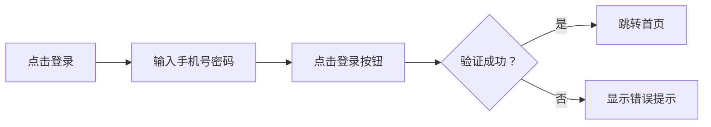
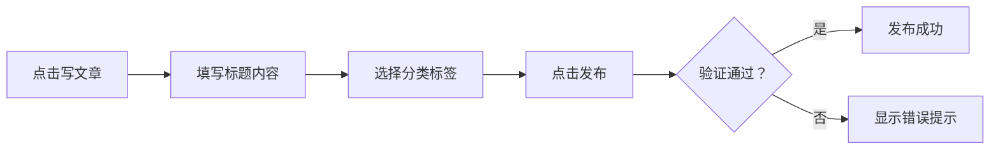

# 原型交互稿模板

**文档状态:** 草稿 / 评审中 / 已定稿  
**版本号:** v1.0  
**创建日期:** 2026-03-12  
**最后更新:** 2026-03-12  
**负责人:** 豆沙 (前端)

---

## 📋 文档信息

| 项目 | 内容 |
|------|------|
| **产品名称** | {产品名称} |
| **原型名称** | {原型名称} |
| **关联 PRD** | [PRD 文档链接] |
| **设计负责人** | 豆沙 |
| **设计工具** | Figma / 墨刀 / Axure |
| **原型链接** | [Figma 链接] |

---

## 📝 修订历史

| 版本 | 日期 | 修改人 | 修改内容 | 审批人 |
|------|------|--------|----------|--------|
| v1.0 | 2026-03-12 | 豆沙 | 初始版本 | - |

---

## 1. 设计概述

### 1.1 设计风格
- **设计语言:** 简洁、现代、易用
- **色彩体系:** 主色 #1890ff，辅助色 #52c41a
- **字体规范:** 思源黑体，14px 基础字号

### 1.2 设计原则
1. **一致性:** 保持全站设计一致
2. **可用性:** 降低用户学习成本
3. **反馈性:** 操作即时反馈
4. **容错性:** 允许用户撤销操作

---

## 2. 页面清单

| 页面 ID | 页面名称 | 路由 | 优先级 | 状态 |
|---------|----------|------|--------|------|
| P001 | 首页 | / | P0 | ✅ 已完成 |
| P002 | 文章详情 | /article/:id | P0 | ✅ 已完成 |
| P003 | 登录页 | /login | P0 | ✅ 已完成 |
| P004 | 文章编辑 | /article/edit | P1 | ⏳ 进行中 |
| P005 | 管理后台 | /admin | P1 | ⏳ 待开始 |

---

## 3. 页面详情

### 页面 1: 首页 (P001)

#### 3.1 页面布局
```
┌─────────────────────────────────┐
│           导航栏                 │
├─────────────────────────────────┤
│  ┌─────────┐  ┌───────────────┐ │
│  │ 侧边栏   │  │   文章列表     │ │
│  │         │  │               │ │
│  └─────────┘  └───────────────┘ │
├─────────────────────────────────┤
│           页脚                   │
└─────────────────────────────────┘
```

#### 3.2 交互说明

**导航栏:**
| 元素 | 交互 | 反馈 |
|------|------|------|
| Logo | 点击 | 跳转到首页 |
| 分类菜单 | 悬停 | 展开子菜单 |
| 搜索框 | 输入 | 实时搜索建议 |
| 登录按钮 | 点击 | 跳转登录页 |

**文章列表:**
| 元素 | 交互 | 反馈 |
|------|------|------|
| 文章卡片 | 点击 | 跳转详情页 |
| 收藏按钮 | 点击 | 收藏/取消收藏 |
| 分页器 | 点击页码 | 加载对应页数据 |

#### 3.3 响应式设计
| 断点 | 布局 | 说明 |
|------|------|------|
| > 1200px | 三栏布局 | 桌面端 |
| 768-1200px | 两栏布局 | 平板端 |
| < 768px | 单栏布局 | 移动端 |

---

### 页面 2: 文章详情页 (P002)

#### 3.4 页面布局
```
┌─────────────────────────────────┐
│           导航栏                 │
├─────────────────────────────────┤
│         文章标题                 │
│         作者信息                 │
├─────────────────────────────────┤
│         文章内容                 │
│         (Markdown 渲染)          │
├─────────────────────────────────┤
│         评论区域                 │
└─────────────────────────────────┘
```

#### 3.5 交互说明

**文章内容:**
| 元素 | 交互 | 反馈 |
|------|------|------|
| 代码块 | 点击复制 | 复制成功提示 |
| 图片 | 点击 | 放大查看 |
| 链接 | 点击 | 新窗口打开 |

**评论区域:**
| 元素 | 交互 | 反馈 |
|------|------|------|
| 发表评论 | 点击 | 弹出评论框 |
| 回复评论 | 点击 | 展开回复框 |
| 点赞评论 | 点击 | 点赞数 +1 |

---

## 4. 组件库

### 4.1 基础组件
| 组件名称 | 用途 | 状态 |
|----------|------|------|
| Button | 按钮 | ✅ 已完成 |
| Input | 输入框 | ✅ 已完成 |
| Modal | 弹窗 | ✅ 已完成 |
| Table | 表格 | ✅ 已完成 |

### 4.2 业务组件
| 组件名称 | 用途 | 状态 |
|----------|------|------|
| ArticleCard | 文章卡片 | ✅ 已完成 |
| ArticleList | 文章列表 | ✅ 已完成 |
| NavBar | 导航栏 | ✅ 已完成 |
| CommentList | 评论列表 | ⏳ 进行中 |

---

## 5. 交互流程

### 5.1 登录流程


### 5.2 文章发布流程


---

## 6. 状态说明

### 6.1 加载状态
| 场景 | 加载方式 | 加载文案 |
|------|----------|----------|
| 页面加载 | 骨架屏 | "加载中..." |
| 列表加载 | 分页加载 | "加载更多" |
| 表单提交 | 按钮 Loading | "提交中..." |

### 6.2 空状态
| 场景 | 空状态文案 | 操作引导 |
|------|------------|----------|
| 文章列表为空 | "暂无文章" | "去写第一篇" |
| 评论为空 | "暂无评论" | "抢沙发" |
| 搜索无结果 | "未找到相关内容" | "换个关键词试试" |

### 6.3 错误状态
| 场景 | 错误文案 | 操作引导 |
|------|----------|----------|
| 网络错误 | "网络开小差了" | "点击重试" |
| 服务器错误 | "服务器繁忙" | "稍后再试" |
| 权限不足 | "无权访问" | "联系管理员" |

---

## 7. 动效设计

### 7.1 转场动效
| 场景 | 动效类型 | 时长 |
|------|----------|------|
| 页面切换 | 淡入淡出 | 300ms |
| 弹窗出现 | 从下向上滑入 | 250ms |
| 列表加载 | 渐入 | 200ms |

### 7.2 交互动效
| 元素 | 动效 | 触发条件 |
|------|------|----------|
| 按钮 | 按压效果 | 点击 |
| 卡片 | 悬停阴影 | 鼠标悬停 |
| 收藏 | 心形动画 | 点击收藏 |

---

## 8. 标注说明

### 8.1 尺寸标注
- 所有尺寸单位为 px
- 间距采用 8px 基准
- 字体大小采用偶数

### 8.2 颜色标注
```css
/* 主色 */
--primary-color: #1890ff;

/* 辅助色 */
--success-color: #52c41a;
--warning-color: #faad14;
--error-color: #f5222d;

/* 中性色 */
--text-primary: rgba(0, 0, 0, 0.85);
--text-secondary: rgba(0, 0, 0, 0.65);
--text-disabled: rgba(0, 0, 0, 0.25);
```

---

## ✅ 审批签字

| 角色 | 姓名 | 日期 | 意见 |
|------|------|------|------|
| 设计负责人 | 豆沙 | 2026-03-12 | ✅ 同意 |
| 产品负责人 | 灌汤 | - | ⏳ 待审批 |
| 前端负责人 | 豆沙 | - | ⏳ 待审批 |

---

**文档位置:** `F:\openclaw\agent\doc\templates\原型交互稿模板.md`  
**使用说明:** 复制此模板到 `doc/design/` 目录，配合 Figma/墨刀原型使用
