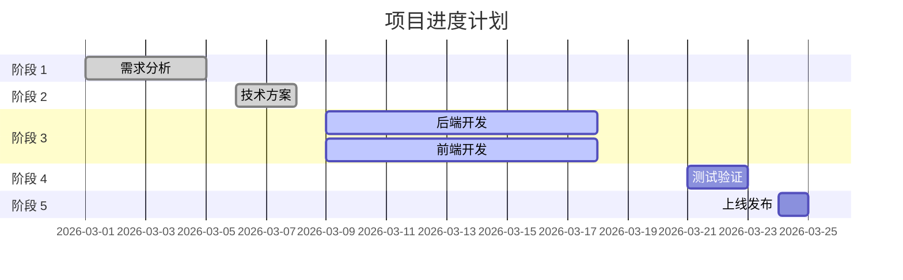
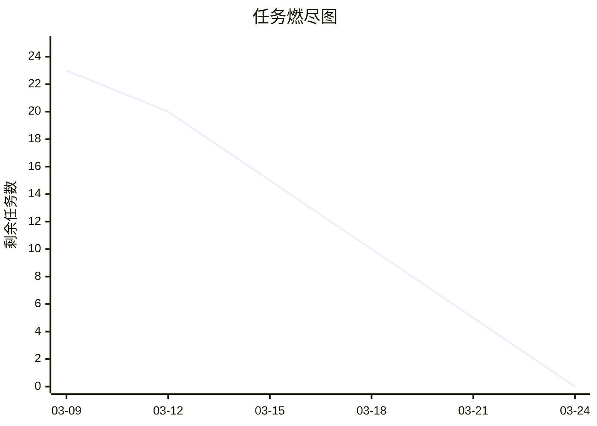
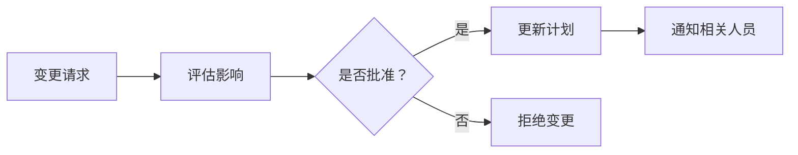

# 项目进度计划模板

**文档状态:** 草稿 / 评审中 / 已定稿  
**版本号:** v1.0  
**创建日期:** 2026-03-12  
**最后更新:** 2026-03-12  
**负责人:** 灌汤 (PM)

---

## 📋 文档信息

| 项目 | 内容 |
|------|------|
| **项目名称** | {项目名称} |
| **项目周期** | 2026-XX-XX ~ 2026-XX-XX |
| **总工期** | {X} 个工作日 |
| **项目经理** | 灌汤 |
| **项目状态** | 🟢 正常 / 🟡 有风险 / 🔴 延期 |

---

## 📝 修订历史

| 版本 | 日期 | 修改人 | 修改内容 | 审批人 |
|------|------|--------|----------|--------|
| v1.0 | 2026-03-12 | 灌汤 | 初始版本 | - |

---

## 1. 项目概述

### 1.1 项目目标
{描述项目目标和交付物}

### 1.2 项目范围
**包含:**
- {项目包含的功能模块}

**不包含:**
- {项目不包含的内容}

### 1.3 关键里程碑
| 里程碑 | 日期 | 交付物 | 状态 |
|--------|------|--------|------|
| 需求评审 | 2026-XX-XX | PRD 定稿 | ✅ 已完成 |
| 技术方案评审 | 2026-XX-XX | 技术方案定稿 | ✅ 已完成 |
| 开发完成 | 2026-XX-XX | 代码完成 | ⏳ 进行中 |
| 测试完成 | 2026-XX-XX | 测试报告 | ⏳ 待开始 |
| 上线发布 | 2026-XX-XX | 上线报告 | ⏳ 待开始 |

---

## 2. 项目计划

### 2.1 阶段划分
| 阶段 | 时间 | 工期 | 负责人 | 状态 |
|------|------|------|--------|------|
| 阶段 1: 需求分析 | 03-01 ~ 03-05 | 5 天 | 灌汤 | ✅ 已完成 |
| 阶段 2: 技术方案 | 03-06 ~ 03-08 | 3 天 | 酱肉 | ✅ 已完成 |
| 阶段 3: 开发实现 | 03-09 ~ 03-20 | 10 天 | 酱肉/豆沙 | ⏳ 进行中 |
| 阶段 4: 测试验证 | 03-21 ~ 03-23 | 3 天 | 测试 | ⏳ 待开始 |
| 阶段 5: 上线发布 | 03-24 | 1 天 | 酸菜 | ⏳ 待开始 |

### 2.2 甘特图

---

## 3. 任务分解

### 3.1 任务清单 (WBS)

#### 阶段 1: 需求分析
| 任务 ID | 任务名称 | 负责人 | 开始 | 结束 | 工期 | 状态 | 前置任务 |
|---------|----------|--------|------|------|------|------|----------|
| TASK-001 | 需求调研 | 灌汤 | 03-01 | 03-02 | 2 天 | ✅ | - |
| TASK-002 | PRD 编写 | 灌汤 | 03-03 | 03-04 | 2 天 | ✅ | TASK-001 |
| TASK-003 | 需求评审 | 灌汤 | 03-05 | 03-05 | 1 天 | ✅ | TASK-002 |

#### 阶段 2: 技术方案
| 任务 ID | 任务名称 | 负责人 | 开始 | 结束 | 工期 | 状态 | 前置任务 |
|---------|----------|--------|------|------|------|------|----------|
| TASK-011 | 技术选型 | 酱肉 | 03-06 | 03-06 | 1 天 | ✅ | TASK-003 |
| TASK-012 | 架构设计 | 酱肉 | 03-07 | 03-07 | 1 天 | ✅ | TASK-011 |
| TASK-013 | 方案评审 | 酱肉 | 03-08 | 03-08 | 1 天 | ✅ | TASK-012 |

#### 阶段 3: 开发实现
| 任务 ID | 任务名称 | 负责人 | 开始 | 结束 | 工期 | 状态 | 前置任务 |
|---------|----------|--------|------|------|------|------|----------|
| TASK-031 | 数据库设计 | 酱肉 | 03-09 | 03-10 | 2 天 | ✅ | TASK-013 |
| TASK-032 | 后端 API 开发 | 酱肉 | 03-11 | 03-16 | 4 天 | 🟡 | TASK-031 |
| TASK-033 | 前端页面开发 | 豆沙 | 03-11 | 03-16 | 4 天 | 🟡 | TASK-013 |
| TASK-034 | 前后端联调 | 酱肉/豆沙 | 03-17 | 03-18 | 2 天 | ⏳ | TASK-032, TASK-033 |

#### 阶段 4: 测试验证
| 任务 ID | 任务名称 | 负责人 | 开始 | 结束 | 工期 | 状态 | 前置任务 |
|---------|----------|--------|------|------|------|------|----------|
| TASK-041 | 测试用例编写 | 测试 | 03-17 | 03-19 | 3 天 | ⏳ | TASK-013 |
| TASK-042 | 功能测试 | 测试 | 03-20 | 03-21 | 2 天 | ⏳ | TASK-034 |
| TASK-043 | 性能测试 | 测试 | 03-22 | 03-22 | 1 天 | ⏳ | TASK-042 |

#### 阶段 5: 上线发布
| 任务 ID | 任务名称 | 负责人 | 开始 | 结束 | 工期 | 状态 | 前置任务 |
|---------|----------|--------|------|------|------|------|----------|
| TASK-051 | 上线方案编写 | 酸菜 | 03-22 | 03-22 | 1 天 | ⏳ | TASK-042 |
| TASK-052 | 上线发布 | 酸菜 | 03-24 | 03-24 | 1 天 | ⏳ | TASK-051 |
| TASK-053 | 上线验证 | 测试 | 03-24 | 03-24 | 1 天 | ⏳ | TASK-052 |

---

## 4. 资源计划

### 4.1 人力资源
| 角色 | 人员 | 投入比例 | 投入阶段 |
|------|------|----------|----------|
| 产品经理 | 灌汤 | 50% | 全程 |
| 后端开发 | 酱肉 | 100% | 阶段 2-4 |
| 前端开发 | 豆沙 | 100% | 阶段 2-4 |
| 测试工程师 | - | 100% | 阶段 4 |
| 运维工程师 | 酸菜 | 50% | 阶段 5 |

### 4.2 设备资源
| 资源 | 配置 | 数量 | 用途 |
|------|------|------|------|
| 开发服务器 | 2 核 4G | 3 台 | 开发环境 |
| 测试服务器 | 2 核 4G | 2 台 | 测试环境 |
| 生产服务器 | 4 核 8G | 2 台 | 生产环境 |

---

## 5. 风险管理

### 5.1 风险清单
| 风险 ID | 风险描述 | 概率 | 影响 | 等级 | 应对措施 | 负责人 |
|---------|----------|------|------|------|----------|--------|
| RISK-001 | 技术难点 | 中 | 高 | 🟡 | 提前调研，预留缓冲 | 酱肉 |
| RISK-002 | 人员变动 | 低 | 高 | 🟡 | 文档化，知识共享 | 灌汤 |
| RISK-003 | 需求变更 | 中 | 中 | 🟡 | 需求冻结，变更流程 | 灌汤 |
| RISK-004 | 测试延期 | 中 | 中 | 🟡 | 提前介入，并行测试 | 测试 |

### 5.2 风险应对
**RISK-001: 技术难点**
- **触发条件:** 开发遇到技术瓶颈 > 4 小时
- **应对措施:** 组织技术讨论，寻求外部支持
- **负责人:** 酱肉

**RISK-003: 需求变更**
- **触发条件:** 需求变更请求
- **应对措施:** 评估影响，走变更流程，调整计划
- **负责人:** 灌汤

---

## 6. 沟通计划

### 6.1 会议安排
| 会议 | 时间 | 频率 | 参与人 | 目的 |
|------|------|------|--------|------|
| 每日站会 | 09:00 | 每日 | 全员 | 同步进度，解决问题 |
| 周例会 | 周一 14:00 | 每周 | 全员 | 周计划，周总结 |
| 里程碑评审 | 里程碑日期 | 按需 | 全员 + 领导 | 里程碑验收 |

### 6.2 沟通渠道
| 渠道 | 用途 | 参与人 |
|------|------|--------|
| 飞书群 | 日常沟通 | 全员 |
| 邮件 | 正式通知 | 全员 + 领导 |
| 文档平台 | 文档协作 | 全员 |

---

## 7. 进度跟踪

### 7.1 进度状态
| 指标 | 计划值 | 实际值 | 偏差 | 状态 |
|------|--------|--------|------|------|
| 总工期 | 22 天 | - | - | ⏳ |
| 已完成任务 | - | 5/23 | -22% | 🟡 |
| 进行中任务 | - | 2/23 | - | 🟢 |
| 未开始任务 | - | 16/23 | - | ⏳ |

### 7.2 里程碑状态
| 里程碑 | 计划日期 | 预计日期 | 偏差 | 状态 |
|--------|----------|----------|------|------|
| 需求评审 | 03-05 | 03-05 | 0 天 | ✅ |
| 技术方案评审 | 03-08 | 03-08 | 0 天 | ✅ |
| 开发完成 | 03-20 | 03-20 | 0 天 | ⏳ |
| 测试完成 | 03-23 | 03-23 | 0 天 | ⏳ |
| 上线发布 | 03-24 | 03-24 | 0 天 | ⏳ |

### 7.3 燃尽图

---

## 8. 变更管理

### 8.1 变更流程

### 8.2 变更记录
| 变更 ID | 变更内容 | 影响 | 变更日期 | 审批人 |
|---------|----------|------|----------|--------|
| - | - | - | - | - |

---

## ✅ 审批签字

| 角色 | 姓名 | 日期 | 意见 |
|------|------|------|------|
| 项目经理 | 灌汤 | - | ⏳ 待审批 |
| 技术负责人 | 酱肉 | - | ⏳ 待审批 |
| 产品负责人 | - | - | ⏳ 待审批 |

---

**文档位置:** `F:\openclaw\agent\doc\templates\项目进度计划模板.md`  
**使用说明:** 复制此模板到 `doc/plan/` 目录，按实际需求填写

---

## 📚 文档索引

**6 个核心文档模板已创建:**

| # | 文档 | 主要目的 | 受众 | 位置 |
|---|------|----------|------|------|
| 1 | PRD 模板 | 让全员理解"要做什么&为什么做" | 前端/后端/测试/运维 | `doc/templates/PRD 模板.md` |
| 2 | API 技术方案模板 | 保证前后端协同一致、减少返工 | 后端、前端、测试 | `doc/templates/API 技术方案模板.md` |
| 3 | 原型交互稿模板 | 消除前端和产品理解偏差 | 前端、测试 | `doc/templates/原型交互稿模板.md` |
| 4 | 测试用例模板 | 让测试知道怎么测、测什么 | 测试 | `doc/templates/测试用例模板.md` |
| 5 | 上线方案模板 | 运维和开发知道怎么上线、如何回滚 | 后端、运维、测试 | `doc/templates/上线方案模板.md` |
| 6 | 项目进度计划模板 | 控制节奏、跟踪状态、风险预警 | 所有人 | `doc/templates/项目进度计划模板.md` |

**下一步:**
1. 创建文档索引 README
2. 通知各 Agent 文档模板已就绪
3. 开始使用模板创建实际项目文档
