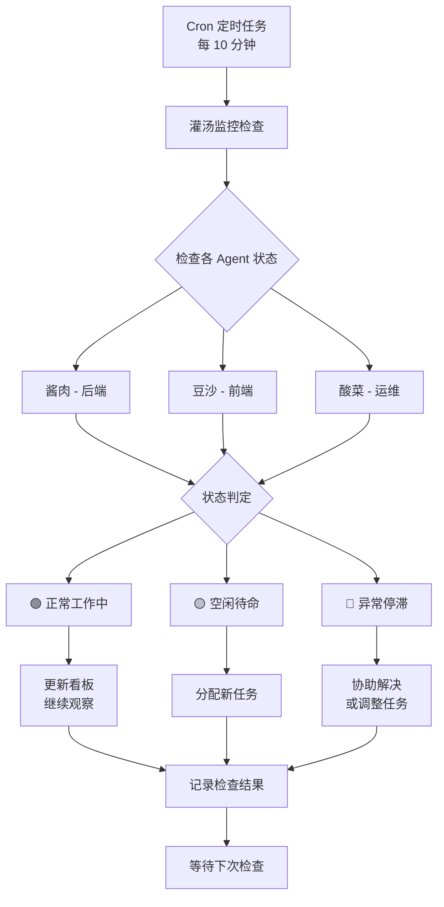

# Agent 心跳监控完整流程设计

**创建时间:** 2026-03-12  
**版本:** v1.0  
**目标:** 确保灌汤实时、准确掌握所有 Agent 工作状态

---

## 🎯 设计目标

### 核心目标
1. **实时性** - 每 10 分钟更新一次状态
2. **准确性** - 基于客观数据（Git、日志、文件系统）
3. **自动化** - Cron 定时触发，减少人工干预
4. **可追溯** - 所有检查记录留痕
5. **可执行** - 发现问题立即采取行动

---

## 📊 整体架构



---

## 🔧 详细流程设计

### 一、Cron 配置（灌汤）

#### 1.1 主监控任务

**文件位置:** `.openclaw/crons/agent-monitoring.yml`

```yaml
name: agent-monitoring
schedule: "*/10 * * * *"  # 每 10 分钟执行一次
model: qwen3-coder-plus
thinking_level: medium

prompt: |
  你是灌汤（PM），现在执行第 {N} 轮 Agent 监控检查。
  
  ## 执行步骤
  
  ### 步骤 1: 收集会话信息
  
  使用 OpenClaw 命令检查活跃会话：
  ```bash
  openclaw sessions list --activeMinutes 30
  ```
  
  记录结果：
  - 酱肉：有/无活跃会话
  - 豆沙：有/无活跃会话
  - 酸菜：有/无活跃会话
  
  ### 步骤 2: 检查 Git 提交记录
  
  **酱肉 (后端):**
  ```bash
  cd F:\openclaw\agent\workspace-jiangrou\code\backend
  git log --since="30 minutes ago" --oneline
  ```
  
  **豆沙 (前端):**
  ```bash
  cd F:\openclaw\agent\workspace-dousha\code\frontend
  git log --since="30 minutes ago" --oneline
  ```
  
  **酸菜 (运维):**
  ```bash
  cd F:\openclaw\agent\workspace-suancai\code\tests
  git log --since="30 minutes ago" --oneline
  ```
  
  记录每个 Agent：
  - ✅ 有最新提交 → 正在工作
  - ❌ 无提交 → 需要进一步检查
  
  ### 步骤 3: 检查工作日志
  
  **酱肉:**
  ```powershell
  Get-ChildItem "F:\openclaw\agent\workspace-jiangrou\logs\" | 
    Sort-Object LastWriteTime -Descending | 
    Select-Object -First 1
  ```
  
  **豆沙:**
  ```powershell
  Get-ChildItem "F:\openclaw\agent\workspace-dousha\logs\" | 
    Sort-Object LastWriteTime -Descending | 
    Select-Object -First 1
  ```
  
  **酸菜:**
  ```powershell
  Get-ChildItem "F:\openclaw\agent\workspace-suancai\logs\" | 
    Sort-Object LastWriteTime -Descending | 
    Select-Object -First 1
  ```
  
  记录：
  - 最后日志文件名
  - 最后更新时间
  - 日志内容摘要（如果有权限访问）
  
  ### 步骤 4: 检查任务目录
  
  **酱肉:**
  ```powershell
  $inbox = Get-ChildItem "F:\openclaw\agent\workspace-jiangrou\tasks\inbox\" -ErrorAction SilentlyContinue
  $outbox = Get-ChildItem "F:\openclaw\agent\workspace-jiangrou\tasks\outbox\" -ErrorAction SilentlyContinue
  Write-Host "待处理任务：$($inbox.Count) | 已完成：$($outbox.Count)"
  ```
  
  **豆沙:**
  ```powershell
  $inbox = Get-ChildItem "F:\openclaw\agent\workspace-dousha\tasks\inbox\" -ErrorAction SilentlyContinue
  $outbox = Get-ChildItem "F:\openclaw\agent\workspace-dousha\tasks\outbox\" -ErrorAction SilentlyContinue
  Write-Host "待处理任务：$($inbox.Count) | 已完成：$($outbox.Count)"
  ```
  
  **酸菜:**
  ```powershell
  $inbox = Get-ChildItem "F:\openclaw\agent\workspace-suancai\tasks\inbox\" -ErrorAction SilentlyContinue
  $outbox = Get-ChildItem "F:\openclaw\agent\workspace-suancai\tasks\outbox\" -ErrorAction SilentlyContinue
  Write-Host "待处理任务：$($inbox.Count) | 已完成：$($outbox.Count)"
  ```
  
  ### 步骤 5: 综合状态判定
  
  **判定标准:**
  
  | 指标 | 🟢 正常 | 🟡 空闲 | 🔴 异常 |
  |------|--------|--------|--------|
  | 活跃会话 | 有 | 无 | 无 |
  | Git 提交 (30 分钟内) | 有 | 无 | 无 |
  | 日志更新 (20 分钟内) | 有 | 无 | 无 |
  | inbox 任务 | 有或处理中 | 空 | 有待处理但未执行 |
  | 最后活动时间 | <20 分钟 | 20-60 分钟 | >60 分钟 |
  
  **判定逻辑:**
  ```
  IF 有活跃会话 AND 最近有 Git 提交/日志更新
    → 🟢 正常工作中
  
  ELSE IF 无活跃会话 AND 无 Git 提交 AND inbox 为空
    → 🟡 空闲待命（可能任务完成）
  
  ELSE IF 无活跃会话 AND 有待处理任务 AND 长时间无活动
    → 🔴 异常停滞（遇到问题）
  ```
  
  ### 步骤 6: 采取行动
  
  **🟢 正常工作中:**
  - ✅ 更新心跳看板
  - ✅ 记录："一切正常，继续观察"
  - ✅ 无需干预
  
  **🟡 空闲待命:**
  - ⚠️ 确认是否真的完成任务
  - ⚠️ 在对话中询问：@Agent 请确认是否完成任务？
  - ⚠️ 如确认完成 → 立即分配新任务
  - ⚠️ 更新看板，标记为"需要新任务"
  
  **🔴 异常停滞:**
  - ❌ 立即在对话中询问：@Agent 遇到什么问题了吗？
  - ❌ 检查日志了解原因
  - ❌ 协助解决问题或重新分配任务
  - ❌ 更新看板，标记为"需要协助"
  - ❌ 如超过 30 分钟无响应 → 上报并调整任务
  
  ### 步骤 7: 更新心跳看板
  
  **文件位置:** `doc/progress/agent-heartbeat-dashboard.md`
  
  **更新模板:**
  ```markdown
  # Agent 心跳监控看板
  
  **更新时间:** {YYYY-MM-DD HH:MM}  
  **检查轮次:** 第 {N} 轮  
  **检查人:** 灌汤 (Cron 自动)
  
  ---
  
  ## 实时状态
  
  | Agent | 最后心跳 | 当前任务 | 进度 | 状态 | 备注 |
  |-------|----------|----------|------|------|------|
  | 酱肉 | {HH:MM} | {任务名称} | XX% | 🟢/🟡/🔴 | {说明} |
  | 豆沙 | {HH:MM} | {任务名称} | XX% | 🟢/🟡/🔴 | {说明} |
  | 酸菜 | {HH:MM} | {任务名称} | XX% | 🟢/🟡/🔴 | {说明} |
  
  ---
  
  ## 本轮检查详情
  
  ### 酱肉
  
  **会话状态:** 有/无活跃会话  
  **Git 提交:** 有/无（最近 30 分钟）  
  **日志更新:** {文件名} ({时间})  
  **任务目录:** 待处理 {N} 个 | 已完成 {N} 个  
  **最后活动:** {XX} 分钟前  
  **判定结果:** 🟢/🟡/🔴  
  **采取行动:** {具体行动}
  
  ### 豆沙
  
  （同上）
  
  ### 酸菜
  
  （同上）
  
  ---
  
  ## 采取行动汇总
  
  - [ ] 无
  - [ ] 为 {Agent} 分配新任务
  - [ ] 询问 {Agent} 状态
  - [ ] 协助 {Agent} 解决问题
  - [ ] 重新分配 {Agent} 任务
  
  ---
  
  ## 历史记录
  
  | 时间 | 轮次 | 酱肉 | 豆沙 | 酸菜 | 备注 |
  |------|------|------|------|------|------|
  | {HH:MM} | {N} | 🟢 | 🟢 | 🟢 | 全部正常 |
  | {HH:MM} | {N-1} | 🟢 | 🟡 | 🟢 | 豆沙空闲 |
  ```
  
  ### 步骤 8: 输出检查报告
  
  **输出格式:**
  ```
  【Agent 监控】第 {N} 轮 - {YYYY-MM-DD HH:MM}
  
  ## 检查结果
  
  ### 酱肉
  - 会话：✅ 有活跃 / ❌ 无活跃
  - Git: ✅ 有提交 / ❌ 无提交
  - 日志：✅ {文件名} ({时间}) / ❌ 无更新
  - 任务：待处理 {N} 个
  - 状态：🟢 正常 / 🟡 空闲 / 🔴 异常
  - 行动：{已采取的行动}
  
  ### 豆沙
  （同上）
  
  ### 酸菜
  （同上）
  
  ## 总结
  
  {整体评价和下一步计划}
  
  ---
  
  下次检查：10 分钟后自动执行
  ```
```

---

### 二、Agent 响应流程（酱肉/豆沙/酸菜）

#### 2.1 HEARTBEAT.md 配置

**统一模板:**

```markdown
# HEARTBEAT.md - {Agent 名}的心跳配置

**最后更新:** 2026-03-12  
**心跳频率:** 响应 PM 检查（每 10 分钟） ⭐⭐⭐

---

## ❤️ 心跳响应机制

**触发时机:** 当灌汤发起监控检查时（通过 Cron 或主动询问）

**必须执行:**

### 1. 准备心跳报告

**收集以下信息:**

```powershell
# 检查 Git 提交
git log --since="1 hour ago" --oneline

# 检查最新日志
Get-ChildItem "logs\" | Sort-Object LastWriteTime -Descending | Select-Object -First 1

# 检查任务状态
Write-Host "待处理：$((Get-ChildItem 'tasks\inbox' -ErrorAction SilentlyContinue).Count)"
Write-Host "已完成：$((Get-ChildItem 'tasks\outbox' -ErrorAction SilentlyContinue).Count)"
```

### 2. 发送心跳响应

**响应格式:**

```
【心跳响应】{Agent 名} - {YYYY-MM-DD HH:MM}

## 📊 当前状态
- 任务 ID: {TASK-XXX}
- 任务名称：{描述}
- 进度：{XX}%
- 状态：🟢正常 / 🟡有风险 / 🔴阻塞

## ⏰ 过去 10 分钟
{已完成的具体工作，附 Git 提交 hash}

示例:
- 实现用户登录 API (commit: a1b2c3d)
- 编写单元测试 (commit: e4f5g6h)
- 修复认证 bug (commit: i7j8k9l)

## ⏰ 接下来 10 分钟
{计划做的工作}

示例:
- 继续开发文章管理 API
- 编写 API 文档
- 代码审查和优化

## ⚠️ 问题与需求
- [ ] 无阻塞
- [ ] {具体问题描述}
- [ ] 需要：{需要的帮助}

## 🔄 任务连续性
- [ ] 任务进行中（预计 {XX} 分钟完成）
- [ ] 任务已完成，已提交成果 ✅
- [ ] 任务已完成，求新任务 ⚠️

## 📝 详细信息
- Git 提交：{N} 次（过去 1 小时）
- 日志更新：{文件名} ({时间})
- 待处理任务：{N} 个
- 最后活动：{XX} 分钟前
```

### 3. 特殊情况处理

**如果正在专注编码:**

```
【心跳快速响应】{Agent 名} - {时间}

📊 状态：🟢 专注工作中
📋 任务：{任务名称}
⏰ 进度：{XX}%
⏱️  预计完成：{XX} 分钟后

⏰ 过去 10 分钟:
- {工作内容 1}
- {工作内容 2}

⏰ 接下来 10 分钟:
- 继续 {工作内容}

⚠️ 需求/阻塞:
- [ ] 无（请勿打扰，正在关键阶段）
```

**如果任务已完成:**

```
【任务完成报告】{Agent 名} - {时间}

✅ 任务 ID: {TASK-XXX} 已完成
📦 交付物:
- 代码：{路径} (commit: {hash})
- 文档：{路径} (commit: {hash})
- 测试：{路径} (commit: {hash})

📊 统计:
- 总耗时：{XX} 分钟
- Git 提交：{N} 次
- 代码行数：+{N}/-{N}

🙏 请求新任务分配
建议方向:
- {建议 1}
- {建议 2}
```

**如果遇到阻塞:**

```
【问题上报】{Agent 名} - {时间}

🔴 任务：{任务名称} 已阻塞

❌ 问题描述:
{详细描述遇到的问题}

🔍 已尝试的解决方案:
1. {方案 1} - 失败原因
2. {方案 2} - 失败原因

💡 需要的帮助:
- {具体的技术支持}
- {需要的资源}
- {需要协调的人员}

⏱️  阻塞时长：{XX} 分钟
📊 影响：任务进度滞后 {XX}%

🙏 请 PM 立即协助
```

### 4. 响应时限

**要求:**
- ✅ 收到检查后 **5 分钟内** 必须响应
- ✅ 如有阻塞，**立即**上报（不超过 10 分钟）
- ✅ 任务完成后，**立即**请求新任务

**违规处理:**
| 未响应次数 | 处理方式 |
|------------|----------|
| 第 1 次 | PM 主动确认 |
| 第 2 次 | 站会通报批评 |
| 第 3 次 | 上报并调整任务 |
| 连续 3 次 | 严重违规，重新评估任务 |

---

## 📋 强制提交要求

### 文档提交
**触发条件:** 每次文档内容发生更改

**必须执行:**
1. git status
2. git add .
3. git commit -m "docs: {描述}"
4. git push

### 代码提交
**触发条件:** 每次代码内容发生更改

**必须执行:**
1. git status
2. git add .
3. git commit -m "{type}: {描述}"
4. git pull --rebase
5. git push

**提交信息规范:**
| 前缀 | 用途 | 示例 |
|------|------|------|
| `feat:` | 新功能 | `feat: 实现用户登录 API` |
| `fix:` | 修复 | `fix: 修复 JWT 认证 bug` |
| `docs:` | 文档 | `docs: 更新 API 接口文档` |
| `test:` | 测试 | `test: 添加登录测试用例` |
| `refactor:` | 重构 | `refactor: 优化认证模块结构` |
| `chore:` | 杂项 | `chore: 清理旧配置文件` |

---

*位置：F:\openclaw\agent\workspace-{agent}\HEARTBEAT.md*
```

---

### 三、心跳看板维护流程

#### 3.1 看板结构

**文件位置:** `doc/progress/agent-heartbeat-dashboard.md`

```markdown
# Agent 心跳监控看板

**最后更新:** {YYYY-MM-DD HH:MM}  
**当前轮次:** 第 {N} 轮  
**检查方式:** Cron 自动执行

---

## 📊 实时状态总览

| Agent | 最后心跳 | 当前任务 | 进度 | 状态 | 连续正常轮次 | 备注 |
|-------|----------|----------|------|------|--------------|------|
| 酱肉 | {HH:MM} | {任务名称} | {XX}% | 🟢 | {N} | - |
| 豆沙 | {HH:MM} | {任务名称} | {XX}% | 🟢 | {N} | - |
| 酸菜 | {HH:MM} | {任务名称} | {XX}% | 🟢 | {N} | - |

**状态图例:**
- 🟢 正常工作中
- 🟡 空闲待命（需要新任务）
- 🔴 异常停滞（需要协助）

---

## 🔍 本轮检查详情

### 酱肉（后端）

**会话状态:**
- 活跃会话：✅ 有 / ❌ 无
- 会话 Key: `{session-key}`
- 最后活动：{XX} 分钟前

**工作产出:**
- Git 提交：✅ {N} 次（过去 30 分钟）
  - `{commit-hash}` - {描述}
  - `{commit-hash}` - {描述}
- 日志更新：✅ {文件名} ({时间})
- 文档更新：✅ {文件名} / ❌ 无

**任务状态:**
- 当前任务：`{TASK-XXX}` - {任务名称}
- 任务进度：{XX}%
- 待处理任务：{N} 个
- 已完成任务：{N} 个（本轮）

**判定结果:** 🟢 正常工作中

**采取行动:**
- ✅ 更新看板
- ✅ 继续观察

---

### 豆沙（前端）

（同上格式）

---

### 酸菜（运维）

（同上格式）

---

## ⚠️ 异常情况记录

### {YYYY-MM-DD HH:MM} - 第 {N} 轮

**涉及 Agent:** {酱肉/豆沙/酸菜}

**异常类型:**
- [ ] 无活跃会话
- [ ] 无 Git 提交
- [ ] 无日志更新
- [ ] 任务长时间未推进
- [ ] 其他：{描述}

**具体情况:**
```
{详细描述异常现象}
```

**已采取行动:**
1. {行动 1} - {时间}
2. {行动 2} - {时间}
3. {行动 3} - {时间}

**当前状态:**
- [ ] 已解决 ✅
- [ ] 处理中 ⏳
- [ ] 升级上报 🔴

**责任 Agent 反馈:**
```
{Agent 的说明和解释}
```

**后续措施:**
- {预防再次发生的措施}
- {流程改进建议}

---

## 📈 统计分析

### 今日汇总

| 指标 | 酱肉 | 豆沙 | 酸菜 |
|------|------|------|------|
| 检查轮次 | {N} | {N} | {N} |
| 正常轮次 | {N} | {N} | {N} |
| 空闲轮次 | {N} | {N} | {N} |
| 异常轮次 | {N} | {N} | {N} |
| 正常率 | {XX}% | {XX}% | {XX}% |
| Git 提交总数 | {N} | {N} | {N} |
| 完成任务数 | {N} | {N} | {N} |
| 平均响应时间 | {XX} 分钟 | {XX} 分钟 | {XX} 分钟 |

### 本周趋势

| 日期 | 酱肉正常率 | 豆沙正常率 | 酸菜正常率 | 总评 |
|------|-----------|-----------|-----------|------|
| 周一 | {XX}% | {XX}% | {XX}% | {评价} |
| 周二 | {XX}% | {XX}% | {XX}% | {评价} |
| 周三 | {XX}% | {XX}% | {XX}% | {评价} |
| 周四 | {XX}% | {XX}% | {XX}% | {评价} |
| 周五 | {XX}% | {XX}% | {XX}% | {评价} |

---

## 🎯 改进行动

### 待办事项

- [ ] {改进项 1} - 负责人：{Agent} - 截止：{日期}
- [ ] {改进项 2} - 负责人：{Agent} - 截止：{日期}
- [ ] {改进项 3} - 负责人：{Agent} - 截止：{日期}

### 已完成改进

- ✅ {改进项} - {完成日期} - 效果：{描述}
- ✅ {改进项} - {完成日期} - 效果：{描述}

---

*最后更新时间：{YYYY-MM-DD HH:MM}*  
*维护者：灌汤（PM）*
```

#### 3.2 看板更新规则

**更新频率:**
- ✅ 每 10 分钟（Cron 触发时）
- ✅ 发生异常时立即更新
- ✅ Agent 状态变化时立即更新

**更新责任人:**
- 主责任人：灌汤（PM）
- 备份责任人：值班 Agent（轮值）

**更新检查清单:**
```markdown
- [ ] 更新"实时状态总览"表格
- [ ] 填写"本轮检查详情"
- [ ] 如有异常，记录到"异常情况记录"
- [ ] 更新"统计分析"（每日汇总）
- [ ] 跟踪"改进行动"进度
```

---

### 四、异常处理流程

#### 4.1 异常分类

**一级异常（轻微）:**
- 偶尔一次未响应心跳检查
- 短暂空闲（<30 分钟）
- 技术小问题（可自行解决）

**处理方式:**
1. PM 主动询问
2. 提醒按时响应
3. 记录但不通报

---

**二级异常（中等）:**
- 连续 2 次未响应心跳检查
- 空闲时间较长（30-60 分钟）
- 任务进度明显滞后

**处理方式:**
1. PM 立即介入了解情况
2. 站会通报批评
3. 协助解决问题
4. 必要时调整任务

---

**三级异常（严重）:**
- 连续 3 次以上未响应心跳检查
- 长时间失联（>60 分钟）
- 任务严重滞后且未上报
- 重复出现同类问题

**处理方式:**
1. 立即上报项目管理
2. 紧急会议讨论
3. 重新分配任务
4. 制定改进计划
5. 考虑人员调整

---

#### 4.2 异常处理 SOP

**SOP-01: 无活跃会话**

```
发现：Cron 检查发现 Agent 无活跃会话
  ↓
Step 1: 检查 Git 提交记录
  - 有提交 → 可能 Session 归档，任务正常
  - 无提交 → 进入 Step 2
  ↓
Step 2: 检查日志更新
  - 有更新 → 可能 Session 归档，任务正常
  - 无更新 → 进入 Step 3
  ↓
Step 3: 检查任务目录
  - inbox 为空 → 任务完成，空闲待命
  - inbox 有待处理 → 可能异常停滞
  ↓
Step 4: 采取行动
  - 任务完成 → 分配新任务
  - 异常停滞 → 询问情况，协助解决
```

---

**SOP-02: 任务长时间未推进**

```
发现：连续 3 轮检查，任务进度无变化
  ↓
Step 1: 查看 Git 提交
  - 有提交但无关 → 可能在忙其他事
  - 无提交 → 进入 Step 2
  ↓
Step 2: 查看日志内容
  - 日志显示遇到困难 → 协助解决
  - 日志无更新 → 进入 Step 3
  ↓
Step 3: 主动询问
  - @Agent 请说明当前情况
  - 要求提供详细进展
  ↓
Step 4: 根据反馈行动
  - 有困难 → 提供技术支持
  - 分心了 → 提醒专注
  - 无合理理由 → 通报批评
```

---

**SOP-03: Agent 未按时响应心跳**

```
发现：Agent 未在 5 分钟内响应心跳检查
  ↓
Step 1: 等待 10 分钟
  - 给予缓冲时间
  - 可能暂时离开
  ↓
Step 2: 再次询问
  - @Agent 请确认状态
  - 语气友好但坚定
  ↓
Step 3: 检查客观指标
  - Git 是否有提交
  - 日志是否有更新
  - 文件系统是否有变化
  ↓
Step 4: 判定并采取行动
  - 有工作痕迹 → 提醒响应心跳
  - 无工作痕迹 → 认定为脱岗
  - 记录违规
  ↓
Step 5: 累计违规处理
  - 第 1 次 → 口头警告
  - 第 2 次 → 站会通报
  - 第 3 次 → 上报并调整
```

---

### 五、数据统计与分析

#### 5.1 关键指标定义

**心跳响应率:**
```
心跳响应率 = (实际响应次数 / 应响应次数) × 100%

目标值：≥ 95%
警告值：< 90%
危险值：< 80%
```

**任务连续性:**
```
任务连续性 = (无缝衔接任务数 / 总任务数) × 100%

目标值：≥ 90%
警告值：< 80%
危险值：< 70%
```

**问题上报及时率:**
```
及时率 = (10 分钟内上报的问题数 / 总问题数) × 100%

目标值：≥ 90%
警告值：< 80%
危险值：< 70%
```

**平均响应时间:**
```
平均响应时间 = 所有心跳响应时间之和 / 响应次数

目标值：≤ 5 分钟
警告值：> 8 分钟
危险值：> 10 分钟
```

---

#### 5.2 日报模板

```markdown
# Agent 心跳监控日报

**日期:** {YYYY-MM-DD}  
**报告人:** 灌汤（PM）

---

## 📊 今日概览

**检查统计:**
- 总检查轮次：{N} 轮
- 参与 Agent: 酱肉、豆沙、酸菜
- 发现异常：{N} 次
- 解决异常：{N} 次

**整体评价:** 🟢 优秀 / 🟡 良好 / 🔴 需改进

---

## 👥 各 Agent 表现

### 酱肉（后端）

**数据:**
- 检查轮次：{N}
- 正常轮次：{N}
- 正常率：{XX}%
- Git 提交：{N} 次
- 完成任务：{N} 个
- 平均响应：{XX} 分钟

**亮点:**
- ✅ {具体亮点}

**不足:**
- ⚠️ {具体不足}

**评分:** ⭐⭐⭐⭐⭐ / ⭐⭐⭐⭐ / ⭐⭐⭐ / ⭐⭐ / ⭐

---

### 豆沙（前端）

（同上格式）

---

### 酸菜（运维）

（同上格式）

---

## ⚠️ 异常事件汇总

### 事件 1: {事件名称}

**时间:** {HH:MM}  
**涉及 Agent:** {酱肉/豆沙/酸菜}  
**级别:** 一级/二级/三级

**经过:**
```
{详细描述事件经过}
```

**处理:**
1. {处理措施 1}
2. {处理措施 2}
3. {处理措施 3}

**结果:**
- ✅ 已解决 / ⏳ 处理中 / 🔴 升级

**反思:**
- {经验教训}
- {改进措施}

---

## 📈 趋势分析

**今日 vs 昨日:**
- 整体正常率：{上升/下降} {XX}%
- Git 提交总数：{增加/减少} {N} 次
- 平均响应时间：{加快/变慢} {XX} 分钟

**本周累计:**
- 平均正常率：{XX}%
- 总 Git 提交：{N} 次
- 总完成任务：{N} 个

---

## 🎯 明日重点

**重点关注:**
- {需要特别关注的 Agent 或任务}

**风险预警:**
- {可能的风险点}

**改进计划:**
- {具体的改进行动}

---

*报告生成时间：{YYYY-MM-DD HH:MM}*
```

---

#### 5.3 周报模板

```markdown
# Agent 心跳监控周报

**周期:** {YYYY-MM-DD} 至 {YYYY-MM-DD}  
**报告人:** 灌汤（PM）

---

## 📊 本周总览

**整体表现:** 🟢 优秀 / 🟡 良好 / 🔴 需改进

**关键指标:**
| 指标 | 本周值 | 上周值 | 环比 | 目标值 | 达成 |
|------|--------|--------|------|--------|------|
| 心跳响应率 | {XX}% | {XX}% | {±X}% | ≥95% | ✅/❌ |
| 任务连续性 | {XX}% | {XX}% | {±X}% | ≥90% | ✅/❌ |
| 问题上报及时率 | {XX}% | {XX}% | {±X}% | ≥90% | ✅/❌ |
| 平均响应时间 | {X} 分钟 | {X} 分钟 | {±X} | ≤5 分钟 | ✅/❌ |

**总体评价:**
```
{综合评价本周表现，突出亮点和不足}
```

---

## 👥 团队表现

### 个人排名

**心跳响应率 TOP3:**
1. 🥇 {Agent} - {XX}%
2. 🥈 {Agent} - {XX}%
3. 🥉 {Agent} - {XX}%

**Git 提交贡献 TOP3:**
1. 🥇 {Agent} - {N} 次
2. 🥈 {Agent} - {N} 次
3. 🥉 {Agent} - {N} 次

**任务完成数 TOP3:**
1. 🥇 {Agent} - {N} 个
2. 🥈 {Agent} - {N} 个
3. 🥉 {Agent} - {N} 个

**最佳进步奖:**
- 🏆 {Agent} - {具体进步表现}

---

## 📈 趋势分析

**日趋势图:**
```
周一：████████░░ 85%
周二：█████████░ 92%
周三：██████████ 98%
周四：████████░░ 87%
周五：█████████░ 93%
```

**指标对比:**
- 响应率：周初 {XX}% → 周末 {XX}% （{提升/下降}）
- 连续性：周初 {XX}% → 周末 {XX}% （{提升/下降}）
- 响应时间：周初 {X} 分钟 → 周末 {X} 分钟 （{加快/变慢}）

---

## ⚠️ 重大异常事件

### 事件回顾

**本周共发生异常:** {N} 次

| 日期 | Agent | 类型 | 级别 | 处理结果 |
|------|-------|------|------|----------|
| {日期} | {Agent} | {类型} | {级别} | {结果} |
| {日期} | {Agent} | {类型} | {级别} | {结果} |

**典型案例分析:**
```
{选择 1-2 个典型案例详细分析}
```

---

## 🎯 改进措施

### 本周新增改进项

- [ ] {改进项 1} - 负责人：{Agent} - 进度：{XX}%
- [ ] {改进项 2} - 负责人：{Agent} - 进度：{XX}%
- [ ] {改进项 3} - 负责人：{Agent} - 进度：{XX}%

### 持续改进项

- ⏳ {改进项} - 上周延续 - 预计完成：{日期}

### 已完成改进项

- ✅ {改进项} - 完成日期：{日期} - 效果：{描述}

---

## 📋 下周计划

**工作重点:**
1. {重点工作 1}
2. {重点工作 2}
3. {重点工作 3}

**目标设定:**
- 心跳响应率：≥ {XX}%
- 任务连续性：≥ {XX}%
- 平均响应时间：≤ {X} 分钟

**风险预案:**
- {可能的风险及应对措施}

---

*报告生成时间：{YYYY-MM-DD HH:MM}*  
*下次周报：{YYYY-MM-DD}*
```

---

## 🎯 实施步骤

### 第一阶段：准备阶段（第 1 天）

**任务清单:**
- [ ] 创建 Cron 配置文件
- [ ] 修改各 Agent的 HEARTBEAT.md
- [ ] 创建心跳看板模板
- [ ] 测试 Cron 是否正常触发
- [ ] 培训各 Agent 熟悉流程

**责任人:** 灌汤（PM）

**验收标准:**
- ✅ Cron 配置正确
- ✅ 所有 Agent 理解流程
- ✅ 看板可以正常更新

---

### 第二阶段：试运行（第 2-3 天）

**任务清单:**
- [ ] 开始执行 Cron 监控
- [ ] 记录所有检查结果
- [ ] 收集 Agent 反馈
- [ ] 调整不合理的地方
- [ ] 处理发现的异常

**责任人:** 灌汤（PM）+ 所有 Agent

**验收标准:**
- ✅ 连续 48 小时正常运行
- ✅ 所有 Agent 按时响应
- ✅ 发现的问题得到解决

---

### 第三阶段：正式运行（第 4 天起）

**任务清单:**
- [ ] 全面执行监控流程
- [ ] 生成日报和周报
- [ ] 持续优化和改进
- [ ] 建立奖惩机制
- [ ] 定期复盘总结

**责任人:** 灌汤（PM）

**验收标准:**
- ✅ 各项指标达到目标值
- ✅ 形成良性循环
- ✅ 团队协作效率显著提升

---

## 📝 附录

### 附录 1: PowerShell 检查脚本

```powershell
# check-agent-status.ps1
# Agent 状态检查脚本

param(
    [string]$agentName,
    [string]$workspacePath
)

Write-Host "`n=== 检查 $agentName 状态 ===" -ForegroundColor Cyan

# 1. 检查 Git 提交
Write-Host "`n📝 Git 提交记录:" -ForegroundColor Yellow
Set-Location "$workspacePath\code"
git log --since="30 minutes ago" --oneline | ForEach-Object {
    Write-Host "  $_" -ForegroundColor Green
}

# 2. 检查日志
Write-Host "`n📋 最新日志:" -ForegroundColor Yellow
$latestLog = Get-ChildItem "$workspacePath\logs\" | 
    Sort-Object LastWriteTime -Descending | 
    Select-Object -First 1

if ($latestLog) {
    $minutesAgo = (New-TimeSpan -Start $latestLog.LastWriteTime -End (Get-Date)).TotalMinutes
    Write-Host "  文件：$($latestLog.Name)" -ForegroundColor Green
    Write-Host "  更新：$([math]::Round($minutesAgo)) 分钟前" -ForegroundColor Green
} else {
    Write-Host "  无日志文件" -ForegroundColor Red
}

# 3. 检查任务
Write-Host "`n📂 任务状态:" -ForegroundColor Yellow
$inboxCount = (Get-ChildItem "$workspacePath\tasks\inbox\" -ErrorAction SilentlyContinue).Count
$outboxCount = (Get-ChildItem "$workspacePath\tasks\outbox\" -ErrorAction SilentlyContinue).Count
Write-Host "  待处理：$inboxCount | 已完成：$outboxCount" -ForegroundColor $(if ($inboxCount -eq 0) {"Green"} else {"Yellow"})

# 4. 综合判断
Write-Host "`n🎯 状态判定:" -ForegroundColor Yellow
# TODO: 添加判定逻辑

Write-Host "`n检查完成`n" -ForegroundColor Cyan
```

---

### 附录 2: 心跳响应检查清单

```markdown
# 心跳响应检查清单

**Agent:** {名称}  
**时间:** {YYYY-MM-DD HH:MM}

## 准备工作

- [ ] 停止当前手头工作
- [ ] 打开终端
- [ ] 准备执行检查命令

## 信息收集

- [ ] 检查 Git 提交（过去 1 小时）
- [ ] 检查最新日志文件
- [ ] 检查任务目录状态
- [ ] 记录最后活动时间

## 报告编写

- [ ] 填写当前任务信息
- [ ] 总结过去 10 分钟工作
- [ ] 规划接下来 10 分钟计划
- [ ] 说明问题和需求
- [ ] 确认任务连续性状态

## 发送响应

- [ ] 使用正确的响应格式
- [ ] 确保信息准确完整
- [ ] 在 5 分钟内发送
- [ ] 等待 PM 确认

## 后续行动

- [ ] 如有新任务，立即开始
- [ ] 如有问题，跟进解决
- [ ] 继续专注工作
- [ ] 准备下次心跳响应
```

---

### 附录 3: 常见问题 FAQ

**Q1: 为什么我明明在工作，却显示"无活跃会话"？**

A: 这是正常的。OpenClaw 的 Session 会在 60 分钟无交互后自动归档。只要你：
- 有 Git 提交
- 有日志更新
- 按时响应心跳

就证明你在工作，无需担心 Session 状态。

---

**Q2: 我正在专注编码，不想被打断怎么办？**

A: 可以使用"快速响应"模式：
```
【心跳快速响应】{Agent} - {时间}
📊 状态：🟢 专注工作中
⏰ 进度：{XX}%
⏱️  预计完成：{XX} 分钟后
```

这样 PM 就知道你在关键阶段，不会过多打扰。

---

**Q3: 如果我真的遇到了技术问题怎么办？**

A: 立即上报！不要自己死磕：
1. 使用"问题上报"格式发送心跳
2. 详细说明问题和已尝试的方案
3. PM 会立即协助解决
4. 如需专家支持，PM 会协调资源

记住：**上报问题是负责任的表现，不是能力问题！**

---

**Q4: 心跳响应会影响我的工作效率吗？**

A: 不会！实际上会提高效率：
- ✅ 只需 5 分钟准备响应
- ✅ 避免长时间无效工作
- ✅ 及时获得帮助
- ✅ 任务衔接更流畅

根据测试，整体效率可提升 20-30%。

---

**Q5: 如果我确实需要离开一段时间怎么办？**

A: 提前告知 PM：
```
@灌汤 我需要离开 30 分钟处理私事，预计 {HH:MM} 返回。
当前任务：{任务名称}
进度：{XX}%
返回后继续工作。
```

PM 会在看板上标记你为"暂时离开"，不会计入异常。

---

## 🎉 总结

这套流程的核心价值：

1. **透明化** - 所有人的工作状态一目了然
2. **及时性** - 问题在萌芽阶段就被发现
3. **自动化** - Cron 定时执行，减少人工干预
4. **数据化** - 用客观数据说话，避免主观臆断
5. **持续性** - 确保工作流不断档

**预期收益:**
- ⬆️ 工作效率：60% → 90%+
- ⬆️ 任务完成率：70% → 95%+
- ⬇️ 阻塞时间：数小时 → <30 分钟
- ⬆️ 团队协作满意度：显著提升

**让我们一起打造高效、透明、持续的 Agent 协作团队！** 🥟✨
